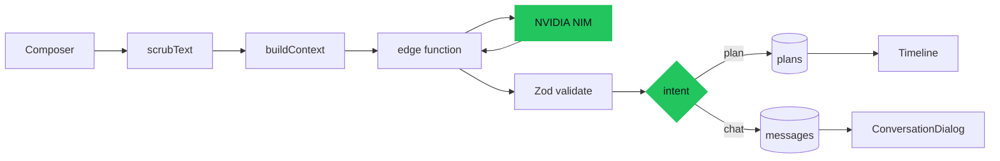

<div align="center">


<h1>Mom.exe</h1>

<p><strong>Your mom, but as an executable.</strong><br>A wellness coach that plans your day around your real classes, mess timings, deadlines, and sleep.</p>

<p>
  <a href="https://github.com/TheLinuxGuy-ssh/Mom.exe/actions"></a>
  <a href="https://github.com/TheLinuxGuy-ssh/Mom.exe/blob/main/LICENSE"></a>
  <a href="https://github.com/TheLinuxGuy-ssh/Mom.exe/releases"></a>
  <a href="https://github.com/TheLinuxGuy-ssh/Mom.exe"></a>
  <a href="https://github.com/TheLinuxGuy-ssh/Mom.exe/issues"></a>
  <a href="https://github.com/TheLinuxGuy-ssh/Mom.exe/commits/main"></a>
  <a href="https://svelte.dev"></a>
  <a href="https://build.nvidia.com"></a>
</p>

<p>
  <a href="https://momexe.vercel.app">Live demo</a> ·
  <a href="#quick-start">Quick start</a> ·
  <a href="#architecture">Architecture</a> ·
  <a href="#deploy-to-vercel">Deploy to Vercel</a> ·
  <a href="https://github.com/TheLinuxGuy-ssh/Mom.exe/issues/new?labels=bug">Report a bug</a> ·
  <a href="https://github.com/TheLinuxGuy-ssh/Mom.exe/issues/new?labels=enhancement">Request a feature</a>
</p>

</div>

<p align="center">
  
</p>

## What it is

Mom.exe is a wellness coach for students who moved out of the home where somebody else used to keep track of their life. You write what is going on in your own words, and it returns a concrete plan for the rest of the day and night.

It is not a habit tracker with a streak counter. Skip breakfast four days running and the app neither scolds you nor resets anything, because you already know.

> [!IMPORTANT]
> Wellness coach, **not medical advice**. It never diagnoses, never mentions calories or weight, and treats missing data as unknown rather than zero.

## Why it exists

Students leaving home lose the one scheduler that ever worked: a person who knew their mess timings, their class schedule, and what time they actually needed to be in bed. Every replacement is either a manual calendar or a streaks app that makes an already bad week visibly worse.

Mom.exe takes a different position. The past only matters as context for now, so it never surfaces failure, never tallies omissions, and never reopens a finished block. Life interrupts plans constantly, so telling it something got in the way quietly rearranges the remainder instead of producing a lecture.

The last line of that is deliberate. The whole reason to build this is to keep someone connected to the person who actually cares, so the coach occasionally says out loud that it is just a program, and says nothing about calling home, tracking, or falling behind.

## Features

- **Plans from free text.** Type "couldn't hydrate at 9:30, friends were in" and the remaining day is rescheduled from the current moment, with the missed need folded into a later block.
- **One input, two intents.** Chatting and planning share the same box. The model classifies the message, and a request to rework the day hands off to the planner automatically.
- **Memory across weeks.** The last 20 messages are resent verbatim, older history is compressed into weekly digests, so the request stays bounded as the log grows.
- **Anonymized by construction.** Names, emails, phone numbers, and links are scrubbed on the way in, before anything is stored, so the copy that reaches the model is the copy the history shows, and the schemas have no field where PII can land.
- **A voice with a hard line.** The coach has a defined register and a ban list for scorekeeper language, and refuses to be funny when someone is actually hurting.
- **Schema validated output.** Every reply is parsed with Zod, validated part by part, and gets one repair retry before falling back to a deterministic planner written in code.
- **Two storage backends, one interface.** Supabase when hosted, localStorage otherwise, behind the same nine method contract.
- **No streaks, no guilt.** There is no way to fail in this app, which is the point.

## Quick start

Prerequisites: Node.js 20 or newer. A Supabase project is optional.

```bash
git clone https://github.com/TheLinuxGuy-ssh/Mom.exe.git
cd Mom.exe
npm install
npm run dev
```

The app serves at `http://localhost:5173` and works with no configuration at all: data lands in localStorage, and planning falls back to the in code planner.

> [!TIP]
> To use the hosted open weight model instead, copy `.env.example` to `.env`, fill in the Supabase values, then run `npm run dev` again. See the hosted setup details under [Installation and usage](#installation-and-usage).

## Installation and usage

<details>
<summary>Environment variables</summary>

| Name | Type | Default | Description |
| --- | --- | --- | --- |
| `VITE_SUPABASE_URL` | string | none | Supabase project URL. Empty selects local mode. |
| `VITE_SUPABASE_ANON_KEY` | string | none | Supabase anon key. Safe to ship in the browser bundle. |
| `VITE_NIM_MODEL` | string | `openai/gpt-oss-20b` | Model id forwarded to the edge function. Must be a live id. |
| `NIM_API_KEY` | string | none | Server side secret. Never reaches the browser. Read only by local dev scripts. |

```dotenv
# client-exposed: inlined into the browser bundle at build time, safe to ship
VITE_SUPABASE_URL=
VITE_SUPABASE_ANON_KEY=
VITE_NIM_MODEL=openai/gpt-oss-20b

# server-side secret: the app never reads this. the Supabase edge function does.
#   supabase secrets set NIM_API_KEY=nvapi-...
#   supabase functions deploy plan
# here it is only used by the local dev scripts: npm run check-nim, npm run eval
NIM_API_KEY=
```

`VITE_*` variables are the only ones Vite inlines into the bundle. That is exactly why `NIM_API_KEY` must live as a Supabase secret rather than in `.env` on a deployed build.

</details>

<details>
<summary>All scripts</summary>

| Command | What it does |
| --- | --- |
| `npm run dev` | Vite dev server with hot reload. |
| `npm run build` | Static production build through `adapter-static`. |
| `npm run preview` | Serves the production build locally. |
| `npm run check` | Runs `svelte-check` across the project. Zero errors expected. |
| `npm test` | Vitest suite, currently 472 tests. |
| `npm run eval` | Four synthetic personas through the live pipeline, reporting schema validity, no medical claims, no shame, and latency. |
| `npm run check-nim` | Probes NVIDIA NIM and prints `LIVE`, `EOL`, or `NOPE` per model id. |
| `npm run test:student` | Thirty-two first person student exchanges through the real pipeline, checking intent routing, the plan contract, and her voice. Without a key it exercises the fallback path and says so instead of scoring failures. |
| `npm run og` | Regenerates `static/og-image.png` from `static/og-image.svg`. |

</details>

<details>
<summary>What happens when you press send</summary>

1. The note is scrubbed of PII, and the last 20 messages plus weekly digests are assembled.
2. One model call returns intent, understanding, advice, plan, handoff, and digests in a single JSON object.
3. Each section is validated independently, so a broken plan does not discard a good understanding.
4. If intent is `chat`, the exchange is logged and a conversation dialog opens. No plan row is written.
5. If intent is `plan`, a plan is saved, superseding the previous one, and the timeline updates.

Notes are not re-saved into the message log on every plan, so context stays cheap while the daily check-in record keeps the history that stats need.

</details>

<details>
<summary>Hosted setup (Supabase + NVIDIA NIM)</summary>

1. Create a Supabase project and apply the schema in the SQL editor.
2. Deploy the edge function (it holds `NIM_API_KEY` server side).
3. Set `VITE_SUPABASE_URL`, `VITE_SUPABASE_ANON_KEY`, and `VITE_NIM_MODEL` in `.env`.
4. `npm run build` and deploy anywhere static.

```bash
supabase link --project-ref <your-ref>
supabase secrets set NIM_API_KEY=nvapi-...
supabase functions deploy plan
```

The schema lives in `supabase/migrations/` and is committed: `0001_profiles.sql` for the profile, `0002_messages.sql` for the conversation log, and `0003_message_sessions.sql` for `session_id`. Apply all three by hand in the Supabase SQL editor. They are committed rather than pushed by the CLI on purpose, because a migration that arrives in your database without you choosing it is not a migration anyone should want.

`session_id` gives one chat session per opening of the app, and a new one when the day rolls over, so the chat box starts empty on a new visit and two chats on the same afternoon are two conversations in the history. It does not shorten her memory: the context engine still reads the last 20 messages across every session.

**Email sign in setup.** Supabase magic link and email OTP share one implementation, so the email template decides which you get. The default template sends only a link, which leaves the six digit code field unusable. Two dashboard changes fix it:

1. Under Auth then URL Configuration, set the Site URL to your deployed URL, and add `http://localhost:5173/**` plus your production URL to Redirect URLs. The app passes `emailRedirectTo: <origin>/login`, which must be on that list.
2. Under Auth then Email Templates then Magic Link, paste a template containing both `{{ .ConfirmationURL }}` and `{{ .Token }}`.

The link path needs no code: the user taps it on the same device, lands back on `/login`, and the app catches the session through `token_hash` detection and `onAuthStateChange`. The code path calls `verifyOtp` and accepts six to ten digits, since Supabase lets you configure the length. Codes and links expire after one hour, with one request per sixty seconds by default.

> [!NOTE]
> Local inference through a custom OpenAI compatible endpoint (Ollama, for example) is still supported by the client, but it is not exposed in the settings UI right now, because the mode was pinned to hosted to keep the interface simple.

</details>

## Model choice, and what was ruled out

This runs `openai/gpt-oss-20b` on NVIDIA NIM, and that was a decision rather than a default. The
alternatives were measured or ruled out rather than assumed:

- **Gemma, evaluated and unavailable.** The cheapest route to the Gemma prize category was to serve a
  Gemma model instead, so that was tried. NVIDIA is not serving this project a Gemma: `gemma-3-27b-it`
  and `gemma-2-2b-it` return `410`, retired; `gemma-3-12b-it`, `gemma-3-4b-it`, `gemma-2-9b-it` and the
  Gemma 4 ids return `404` or hang. Local inference is not a substitute either — gemma-3-27b wants
  about 16GB and the machine this was built on has no GPU and 7GB of RAM, so the 4B variant would
  manage a few tokens a second and add a minute to every note.
- **OpenRouter, tried and reverted.** Same model, cheaper plumbing, and the migration found a real
  bug: `reasoning_effort` is an OpenAI/gpt-oss field that OpenRouter does not accept, and sending it
  fails every request in a way that surfaces to the user as "could not reach the model". That failure
  prompted `src/lib/llm/capabilities.ts`, which is why the request shape is now model-aware.
- **Gemma is still one env var away** if NVIDIA serves it again: set `VITE_NIM_MODEL` and run
  `npm run check-nim`. The reasoning-parameter gate already exists to make that safe.

## Configuration

Behavioral tuning lives in code rather than in a settings panel.

| Option | Type | Default | Description |
| --- | --- | --- | --- |
| `MEMORY_WINDOW` | number | `20` | Recent messages resent verbatim as context. |
| `DIGEST_WEEKS` | number | `4` | Weeks of compressed history carried alongside. |
| `SWAP_MS` | number | `560` | Duration of the crossfade between phases. |
| `SAY_MS` | number | `420` | Duration of the caption crossfade. |
| `SAD_MS` | number | `4000` | Dwell time per phase on the landing animation. |
| `HAPPY_MS` | number | `8000` | Dwell time for the second phase. |
| `NOTE_MIN` | number | `10` | Minimum characters before the composer will send. |
| `CHAT_MIN` | number | `1` | Minimum characters inside the conversation dialog. |

An empty submission never reaches the model. Pressing the send button with nothing typed says so and
focuses the box, rather than running a planning round trip and answering a question nobody asked —
`hasSomethingToSend` in `src/lib/engine/prompt-rules.ts`, checked in the composer and again at the
dashboard boundary. The button stays pressable on purpose: a dead button explains nothing.

Note the deliberate difference between *empty* and *contentless*. `"idk"` and `"Hi."` have characters
in them and still mean "plan me a day", which is what `isContentFree` decides and what the send
button promises. Only a box with nothing in it is refused.

Action and flag names are fixed enums in `src/lib/engine/actions.ts`. The prompt forbids inventing new ones and the Zod schema rejects any that appear.

> [!IMPORTANT]
> Run `npm run eval` after touching `src/lib/llm/prompt.ts`. Scorekeeper language and medical claims are the two easiest regressions to introduce, and neither is caught by type checking.

## Architecture



| Component | Responsibility |
| --- | --- |
| `src/lib/engine/context.ts` | Assembles the anonymized payload, including elapsed plan blocks as `done`, `skipped`, `unknown`, or `in_progress`. |
| `src/lib/engine/memory.ts` | Recent window, weekly digests, and digest batching. Pure and fully tested. |
| `src/lib/engine/shape.ts` | Maps the 15 plan actions onto 4 categories for the day shape widget. |
| `src/lib/llm/prompt.ts` | The system prompt, including the voice block and the intent contract. |
| `src/lib/llm/normalize.ts` | Repairs near miss output before validation: action aliases, loose times, overlaps. |
| `src/lib/llm/generate.ts` | Parses the envelope, validates each part, retries once, falls back to the code planner. |
| `src/lib/storage/` | One `Storage` interface, two implementations. |

Four decisions worth knowing:

**Partial validation instead of all or nothing.** `parseOneShot` checks understanding, advice, and plan separately. A reply with a broken plan still records what the student said about their day.

**The fallback planner is real code, not a stub.** When the model is unreachable, a deterministic planner produces a genuine schedule from targets, mess windows, and sleep debt. You get a plan either way.

**Unknown is never zero.** `sleep_hours: null` means not recorded, and every stat carries an `n` beside its value so the prompt can be told the difference between a low average and a thin sample.

**Intent is decided inside the single call.** Adding a separate classifier round trip would double latency and add a failure mode for no gain, since the model already sees the full context.

## Tech stack

| Layer | Technology |
| --- | --- |
| Frontend |     |
| Backend |    |
| Validation |  |
| Animation |  |
| Testing |   |
| Tooling |   |

## Project structure

```bash
src/
├── lib/
│   ├── engine/       # pure logic: context, memory, shape, stats, time, scrub
│   ├── llm/          # prompt, schema, parser, normalize, client, template fallback
│   ├── storage/      # Storage interface plus localStorage and Supabase backends
│   ├── components/   # one Svelte file per surface
│   └── auth/         # session and Supabase auth helpers
├── routes/           # landing, login, onboarding, dashboard, history, settings
├── app.css           # design tokens, badges, cards, sticky and whisper notes
scripts/              # eval, nim check, og render, student persona walkthrough
dev-fixtures/         # four synthetic personas for eval and demo seeding
supabase/migrations/  # SQL applied by hand in the Supabase SQL editor
```

The `engine/` and `llm/` directories import no Svelte, which is what makes the 421 unit tests runnable without a DOM.

## Deploy to Vercel

This is a static SPA built with `adapter-static` into `build/`, and `vercel.json` already wires the important parts.

```bash
npx vercel            # preview
npx vercel --prod     # production
```

What `vercel.json` handles for you:

- `framework: null` with an explicit `buildCommand` and `outputDirectory`, so Vercel treats this as a plain static site instead of applying its SvelteKit SSR preset, which would look for `.svelte-kit/output`.
- A catch-all rewrite to `/index.html` that excludes `_app`. Without it a shared link like `/dashboard` returns 404, because an SPA build emits only `index.html`. Real files such as `og-image.png`, `robots.txt`, and `favicon.svg` are served from the filesystem first, so they are never rewritten.
- Long lived immutable caching for hashed `_app` assets, plus `nosniff`, `Referrer-Policy`, `X-Frame-Options`, and a locked down `Permissions-Policy`.

Set these as Vercel environment variables for both Preview and Production, then redeploy, since `VITE_*` values are baked in at build time.

| Variable | Required | Notes |
| --- | --- | --- |
| `VITE_SUPABASE_URL` | for hosted mode | Your project URL. Setting it selects proxy mode. |
| `VITE_SUPABASE_ANON_KEY` | for hosted mode | Public anon key, safe in the browser. |
| `VITE_NIM_MODEL` | recommended | A live NVIDIA NIM model id such as `openai/gpt-oss-20b`. |

`NIM_API_KEY` must **not** be a Vercel build variable. Only `VITE_*` variables reach the browser, and the key is read only by the Supabase edge function.

One post deploy chore: upload `static/og-image.png` under repo Settings then Social preview, so link previews show the thumbnail instead of the README. The domain is already set in `src/app.html`, `static/robots.txt` and `static/sitemap.xml`.

## Troubleshooting

<details>
<summary>"planned in code, not by the model" banner</summary>

That banner means the model call failed and the deterministic planner took over. Work through it in this order.

**1. Is the edge function deployed?**

```bash
curl -i "$VITE_SUPABASE_URL/functions/v1/plan" -H "Authorization: Bearer $USER_JWT"
```

The Supabase gateway verifies a JWT before your code runs, so this `401`s with `UNAUTHORIZED_NO_AUTH_HEADER` even on a healthy deployment unless you send a signed-in user's access token. With one, a `200` and `{"ok":true}` means deployed and reachable.

There is no `/health` route: the function answers `GET` on its own path, so a `/health` suffix returns `404` even when everything is fine. A `404` on the bare path means the function does not exist yet, and no environment variable can fix that. Deploy it with the `supabase secrets set` and `supabase functions deploy plan` commands shown under [Installation and usage](#installation-and-usage).

**2. Is your model still on NVIDIA NIM?** Model ids get retired without warning.

```bash
npm run check-nim
```

This prints `LIVE`, `EOL`, or `NOPE` per id. As of writing, `openai/gpt-oss-20b` and `moonshotai/kimi-k3` respond, while `meta/llama-3.1-8b-instruct` returns `410 Gone` and several older Qwen, Mistral, and Nemotron ids return `404`.

**3. Are you signed in?** Hosted mode is the proxy, and the proxy requires a Supabase user JWT. In browser local mode there is no token, so the proxy correctly refuses.

</details>

<details>
<summary>Measured behaviour</summary>

All numbers below are from live runs against `openai/gpt-oss-20b` on NVIDIA NIM, in the configuration
this repo ships. They are ranges across repeated runs, not a best run, because the honest answer is
that this model is inconsistent and the numbers move.

| Metric | Value |
| --- | --- |
| Intent routing, `npm run test:student` | 29 to 32 of 32 across repeated runs |
| Turns needing the code planner or a recovery path | 1 to 10 of 32, depending on provider load |
| Voice, shame and service-desk checks | 0 failures on the best run, 1 to 5 on the worst |
| Plan validity across 4 synthetic personas, `npm run eval` | **5 of 8 first shot, 5 of 8 after repair** |
| No medical claims / no scorekeeper language | 8/8 on every run |
| Latency, one combined call | 7 to 31s |
| Model output length | around 2.3k characters |

**The plan-validity number is the one to read honestly.** An earlier version of this file claimed
8/8 and that was true when it was written; re-measured against the current prompt and the current
provider it is 5/8, and the repair retry is not recovering the difference — it re-asks the model with
a skeleton and the model produces something else invalid just as often. Roughly one note in four ends
up handled by the deterministic planner instead.

That is a real limitation of an open 21B model being asked for a strict JSON envelope, and it is why
`templatePlan` exists and is not a toy: when the model's plan cannot be trusted, a day written in code
is a better answer than no day at all. Closing the gap properly is future work — schema-constrained
decoding is the obvious route, since it would remove the possibility of invalid output rather than
detect it afterwards.

Routing being stable while plan validity is not is the expected shape of the problem: deciding
*whether* to plan is a classification the model is good at, and emitting a *valid* plan is a
formatting task it is mediocre at.

Latency is inherent to reasoning models on a long context, and it is why `reasoning_effort` matters.
At the default medium or high, the same call burned the entire token budget on reasoning and
returned zero content (41s, `finish_reason: length`), which surfaced as the unreachable banner. With
`reasoning_effort: 'low'` now the default, the same call returns full output in roughly 12s.

**What the live runs changed.** A harness that only ever ran against the template planner would have
passed while the real thing quietly failed. These three were found only by spending a key:

1. An empty model reply was treated as unrecoverable. gpt-oss sometimes spends the whole budget on
   reasoning and answers with nothing, so one retry now doubles the room. This was the single most
   common reason a real note fell through to the code planner.
2. A reply that arrived as plain sentences instead of the JSON envelope was thrown away, and the
   student got a generic schedule instead of the good answer the model had already written. Her
   prose is now kept as the reply.
3. The repair retry said "that was invalid" without saying what was missing, so a first greeting
   answered with small talk failed the retry and fell through too. It now names the missing field and
   shows the shape it wants.

4. The model sometimes emits JSON that will not parse: a stray quote, or a doubled closing brace
   after the understanding object. Because the classifier had already called the turn a
   conversation, the repair path was skipped entirely and a student who had typed three honest
   sentences got silence. An unreadable reply is now always retried, and if the retry is unreadable
   too, her reply is pulled out of the wreckage with a regex rather than replaced by a schedule.

The routing number also moved from 27/32 to 32/32, by fixing two things the harness had been quietly
scoring as failures: `could not` and `couldn't` were not recognised as a missed need even though
`cannot` was, so the README's own headline example only rescheduled the day for students who happened
to type the contraction; and "what now" was not heard as a request for a day.

One known miss, left visible on purpose: she still occasionally says "you missed dinner again" to a
student who told her they skipped dinner. The prompt bans that construction by name and she does it
anyway. It is reported by `npm run test:student` rather than quietly patched, because a rewriting rule
that decides what she "meant" is the kind of thing that quietly ruins everything else.

</details>

<details>
<summary>Privacy, honestly</summary>

- Notes are scrubbed **before they are stored**, not just before they are sent, so a name typed into a note never reaches the database. That is a stronger promise than the browser-side-only version, and it has a cost: your own history reads back with a few things replaced by `[email]` or `[name removed]`.
- The scrubber works by pattern, so it is only as good as a pattern. A name introduced with "my name is" is always caught, and a capitalised name after "I'm" usually is. A lowercase `im arun` reads exactly like `im tired` and is left alone, on the grounds that destroying the word a note was actually about is worse than letting one name through.
- The model never sees your name, email, or exact birth date, the schemas have no field where PII could land, and the edge proxy drops unknown keys.
- Hosted mode sends anonymized behavioral context to a third party API (NVIDIA NIM, open weight models). The app never sends a name, an email, or a birth date.
- Export or wipe all of your data from Settings at any time. Wipe also deletes conversations and digests.
- What you see in the history tab is exactly what the model saw. There is no separate raw copy kept anywhere.

</details>

<details>
<summary>SEO, thumbnail, and logo</summary>

Link previews read tags from `src/app.html` and never run JavaScript, so the Open Graph and Twitter Card tags live there rather than in `svelte:head`.

- The URL is already `https://momexe.vercel.app` across `canonical`, `og:url`, `og:image` and `twitter:image`. If you ever move it, change all four together — a canonical pointing somewhere else than the OG tags splits the signal.
- `static/og-image.svg` is the thumbnail source of truth at 1200x630. Edit it, then run `npm run og` to regenerate the PNG, since crawlers render the PNG.
- `static/favicon.svg` is the logo, the wobbling mug, also used as the apple touch icon. Replace it freely.
- Update the domain in `static/robots.txt` and `static/sitemap.xml`.

</details>

## Roadmap

- [x] Natural language check ins with negation aware extraction
- [x] Deterministic template planner fallback
- [x] Dual storage backends behind one interface
- [x] Intent routing between conversation and planning
- [x] Cross week memory with weekly digests
- [x] PII scrubbing on every outbound request
- [x] Voice pass with a ban list for scorekeeper language
- [x] Desktop widgets for sleep, meals, and day shape
- [ ] Push notifications for upcoming blocks (proposed, not started)
- [ ] Export conversations as JSON
- [ ] Weekly digest view in the history tab
- [ ] Decide whether local inference comes back, and if so where it lives

See [open issues](https://github.com/TheLinuxGuy-ssh/Mom.exe/issues) for the full list.

## Contributing

```bash
git clone https://github.com/TheLinuxGuy-ssh/Mom.exe.git
cd Mom.exe
npm install
npm run check && npm test
```

CI runs on every push and pull request and gates exactly those two commands plus a production build
with no environment variables, because the unconfigured local-mode path is the one that has to
always work. Nothing in CI needs a secret, a database, or a GPU.

Branch as `feat/short-slug`, `fix/short-slug`, or `docs/short-slug`. Conventional commit prefixes (`feat:`, `fix:`, `docs:`, `test:`) drive the changelog.

> [!IMPORTANT]
> If you touch `src/lib/llm/prompt.ts`, run `npm run eval` against the live model and paste the results in your pull request. Prompt changes are the easiest thing in this repo to break silently, because nothing in the type system catches them.

## Community and support

- Questions and ideas: [GitHub Discussions](https://github.com/TheLinuxGuy-ssh/Mom.exe/discussions)
- Bugs: [open an issue](https://github.com/TheLinuxGuy-ssh/Mom.exe/issues/new?labels=bug) with your Node version, whether Supabase was configured, and the note you sent.
- Security: see [SECURITY.md](SECURITY.md). Please do not open a public issue first.
- Conduct: [CODE_OF_CONDUCT.md](CODE_OF_CONDUCT.md)

## Contributors

All contributions are welcome.

<a href="https://contrib.rocks/image?repo=TheLinuxGuy-ssh/Mom.exe"></a>

## Star history

<picture>
  <source media="(prefers-color-scheme: dark)" srcset="https://api.star-history.com/svg?repos=TheLinuxGuy-ssh/Mom.exe&type=Date&theme=dark&hide_border=true">
  <source media="(prefers-color-scheme: light)" srcset="https://api.star-history.com/svg?repos=TheLinuxGuy-ssh/Mom.exe&type=Date&hide_border=true">
  
</picture>

## License

[MIT](LICENSE). Built for a friend, for the Hacktoberfest Weekend Challenge.

## Acknowledgements

- [NVIDIA NIM](https://build.nvidia.com) for serving open weight models
- [Supabase](https://supabase.com) for Postgres, auth, and the edge proxy
- [LottieFiles](https://lottiefiles.com) for the landing animations
- [Svelte](https://svelte.dev) and [SvelteKit](https://kit.svelte.dev) for the framework
- [Tailwind CSS](https://tailwindcss.com) for styling
- [Caveat](https://fonts.google.com/specimen/Caveat) and [Archivo Black](https://fonts.google.com/specimen/Archivo+Black) for the handwriting and display faces